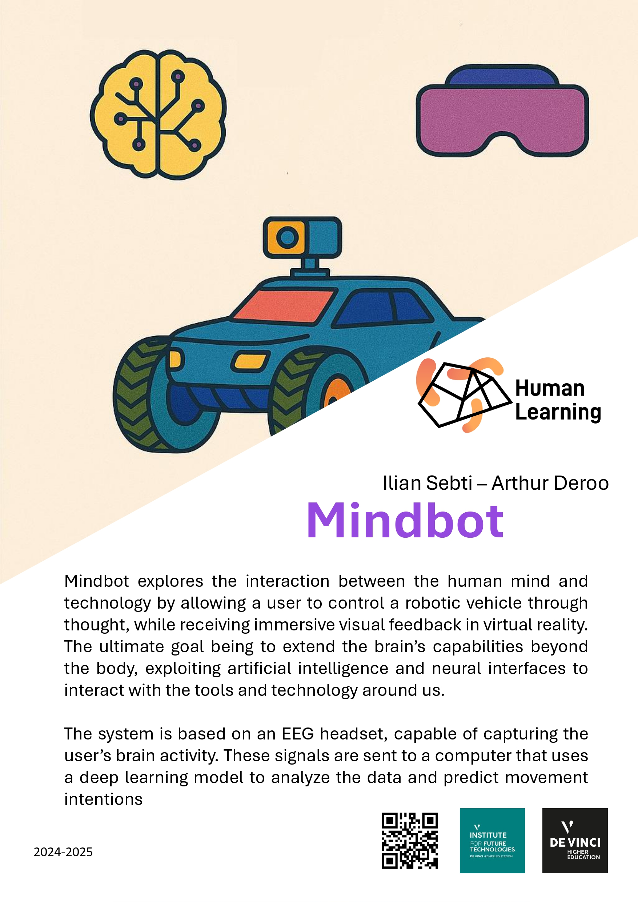

# Mindbot: Brain-Controlled RC Car Prototype

Mindbot is an experimental prototype that integrates brain-computer interface (BCI) technology with an RC car, enabling control through EEG signals. The project combines an EEG headband, an ESP32-controlled RC car, a camera stream, and a VR headset for immersive control and feedback.



<video width="640" height="360" controls>
  <source src="readme_media/demo.mp4" type="video/mp4">
  Your browser does not support the video tag.
</video>
---

## Features

- **Brain-Controlled RC Car**: Use EEG signals from a Muse 2 headband to control the movement of an RC car.
- **Real-Time Camera Stream**: View the car's perspective through a live video feed streamed via WebSocket.
- **VR Integration**: Enhance the experience with a VR headset for immersive control.
- **Modular Design**: The project is split into multiple components, allowing for flexibility and future expansion.

---

## Requirements

### Hardware
- Muse 2 EEG headband
- RC car with an ESP32 microcontroller
- ESP32-CAM module for video streaming
- VR headset (optional)

### Software
- Python 3.8+
- Arduino IDE for ESP32 programming
- Required Python libraries (see below)

---

## Setup Instructions

### 1. Prepare the ESP32 for RC Car Control
1. Open the ESPcar.ino file in the Arduino IDE.
2. Set your WiFi credentials in the `ssid` and `password` variables.
3. Upload the code to your ESP32.
4. Connect the ESP32 to the RC car's motor driver.

### 2. Prepare the ESP32-CAM for Video Streaming
1. Open the ESPstream.ino file in the Arduino IDE.
2. Set your WiFi credentials in the `ssid` and `password` variables.
3. Upload the code to your ESP32-CAM.
4. Ensure the ESP32-CAM is powered and connected to the same network.

### 3. Install Python Dependencies
Run the following command to install the required Python libraries:
```bash
pip install -r requirements.txt
```

### 4. Start the EEG Stream
1. Connect your Muse 2 EEG headband.
2. In a terminal, run:
   ```bash
   muselsl stream
   ```
3. (Optional) To visualize the EEG data, run in another terminal:
   ```bash
   muselsl view --version 2
   ```

### 5. Launch the Brain-Controlled Interface
1. Open the BCI_predict.py file and set the `ESP32_IP` variable to the IP address of your ESP32 controlling the RC car.
2. Run the script:
   ```bash
   python BCI_predict.py
   ```

---

## Project Workflow

1. **ESP32 RC Car Control**: The ESP32 serves as a WebSocket server, receiving commands (`forward`, `reverse`, `left`, `right`, `stop`) to control the car's motors.
2. **ESP32-CAM Video Stream**: The ESP32-CAM streams live video to a web interface, providing a first-person view of the car's surroundings.
3. **EEG Signal Processing**: The Muse 2 headband streams EEG data, which is processed in real-time using a trained neural network (`EEGNet`) to predict user intentions.
4. **Command Transmission**: Predicted commands are sent to the ESP32 controlling the RC car.

---

## Usage

1. Power on the RC car and ESP32-CAM.
2. Start the EEG stream using `muselsl`.
3. Launch the BCI_predict.py script to process EEG data and control the car.
4. Open the ESP32-CAM's web interface in a browser to view the live video feed.
5. (Optional) Use a VR headset for an immersive experience.

---

## Current Limitations

- **Prototype State**: The project is in an unfinished prototype stage and may require manual adjustments.
- **Multiple Terminals**: Requires 2-3 terminals to run different components.
- **Limited Accuracy**: The EEG-based control relies on a trained neural network and may require further tuning for better accuracy.

---

## Future Improvements

- Integrate all components into a single streamlined interface.
- Improve the accuracy of EEG signal classification.
- Add support for additional EEG devices.
- Enhance the VR experience with real-time feedback.

---

## File Structure

```
Mindbot/
├── script/
│   ├── main.py               # Main script for recording EEG data
│   ├── ESPcar/ESPcar.ino     # ESP32 code for RC car control
│   ├── ESPstream/ESPstream.ino # ESP32-CAM code for video streaming
│   ├── EEGNet_Training.ipynb # Notebook for training the EEGNet model
├── BCI_predict.py            # Script for real-time EEG prediction and car control
├── .gitignore                # Git ignore file
└── README.md                 # Project documentation
```

---

## License

This project is open-source and available under the MIT License. Feel free to contribute and improve the project!